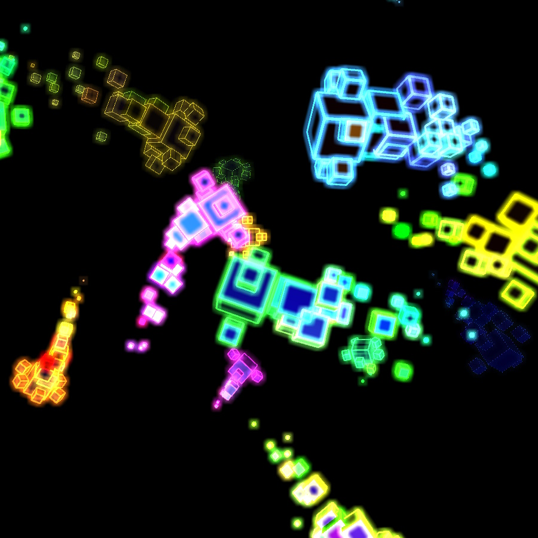
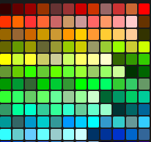
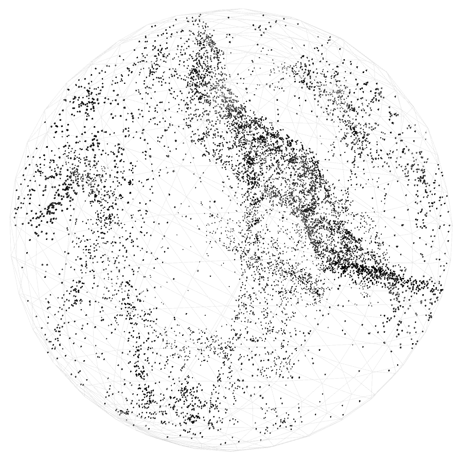
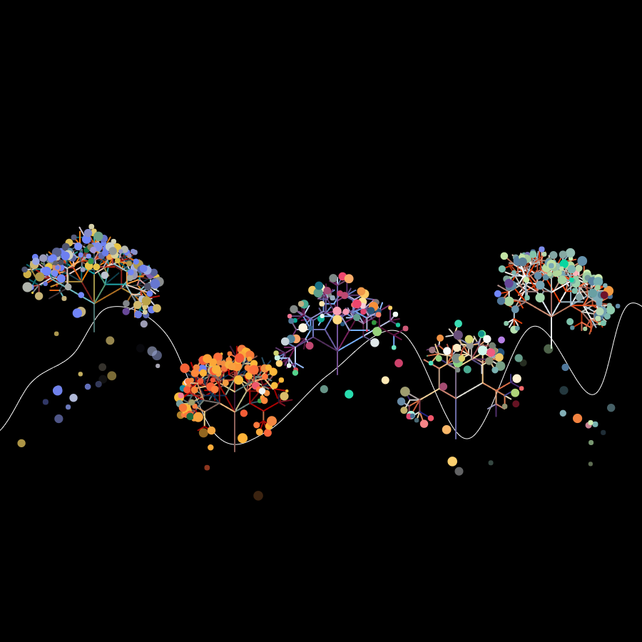
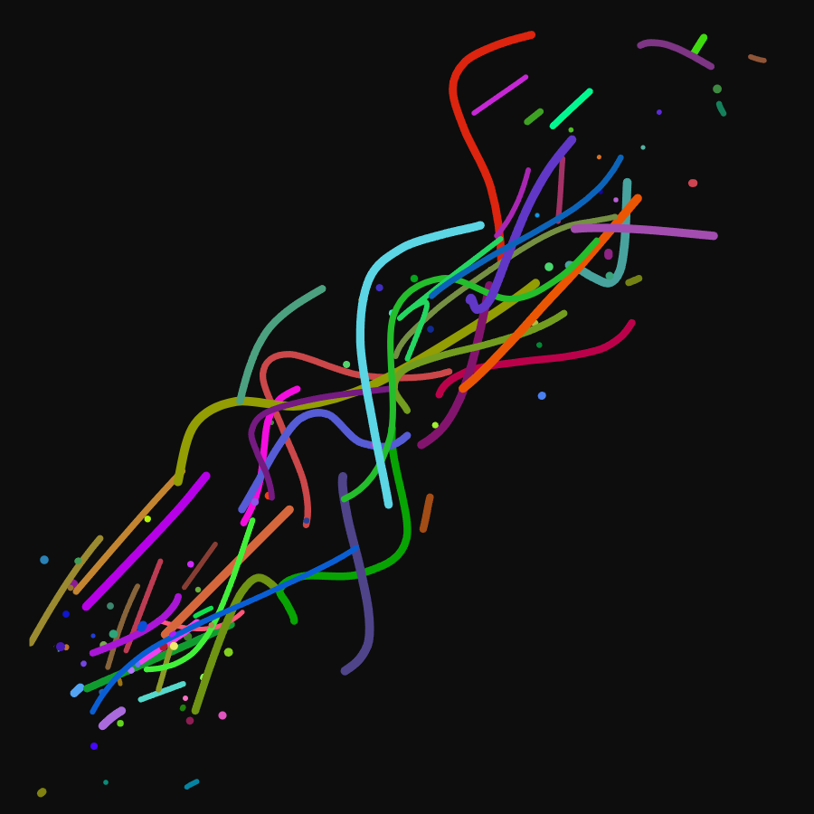
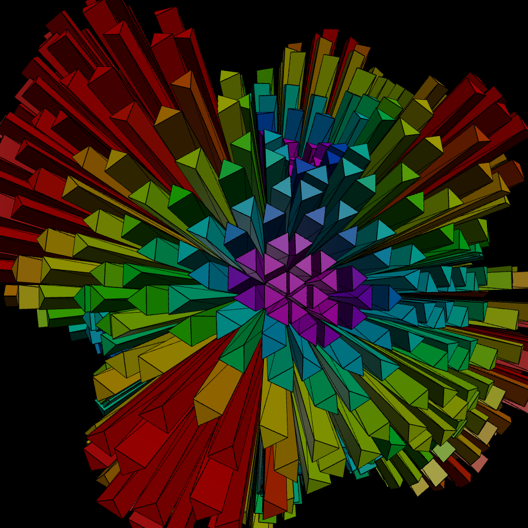

# I'm Mark!

Backend engineer from Melbourne with 20+ years of shipping production systems. I've been building in Spring Boot and Laravel, lately I've also been putting AI agents to work on things of questionable importance.

I like problems without straightforward solutions. Cracking open challenging issues with clever algorithms is immensely satisfying! It's always enjoyable to learn something new. Recently I've employed Bayesian tuning, integer linear programming, multi-agent pipelines, explainable boosting machines, quaternions and L-systems.

I'm also into creative coding and generative art - some examples are further down the page.

## What I've been building

| Project | Description |
|---|---|
| [**BitBrush**](https://github.com/mark-dingwall/BitBrush) | Real-time collaborative pixel canvas. REST APIs for canvas state, WebSocket/STOMP for live broadcasts, thread-safe placement banking.  Spring Boot · WebSocket/STOMP · Postgres · Flyway · Fly.io |
| [**Mystery-Manager**](https://github.com/mark-dingwall/Mystery-Manager) | Allocates bulk produce overage into mystery boxes that customers actually want. Bayesian hyperparameter tuning picks the weights, an ILP solver does the allocation and a glass-box ML model finds the gaps.  Python · Optuna · PuLP/HiGHS · EBM · Ordinal regression |
| [**apples-to-apples**](https://github.com/mark-dingwall/apples-to-apples) | AI-driven pricing pipeline. Playwright feeds 3 LLM stages with 8 parallel agents. Deterministic cross-validation of output with graceful fallback, trend analysis and audit trail.  Python · Playwright · LLM orchestration · AI-drive SWOT analysis |
| [**Zeroshot**](https://github.com/mark-dingwall/zeroshot) *(fork)* | Extended an open-source multi-agent engine with parallel analyst clusters, real-time subagent tracking and parameterised templates. Added a framework-agnostic quality gate system.  JavaScript · Multi-agent architecture |
| [**Clippy's Revenge**](https://github.com/mark-dingwall/Clippys-Revenge) | Terminal visual effects plugin for tattoy: fire, alien invaders, hungry microbes and one very angry paperclip destroy your work!  Python · Rust · tattoy plugin protocol · JSON stdin/stdout |
| [**mark-dingwall.github.io**](https://github.com/mark-dingwall/mark-dingwall.github.io) | Personal site with shader magic, portfolio showcase, creative coding sketches and a realtime multiplayer canvas.  JavaScript · Processing · GSAP · GLSL |

<table>
  <tr>
    <td align="center" width="25%">
       
      <strong>cubeworms</strong> 
      <a href="https://mark.dingwall.com.au/sketches/cubeworms">See it live</a> · <a href="https://github.com/mark-dingwall/cubeworms">Get the code</a>
    </td>
    <td align="center" width="25%">
       
      <strong>BitBrush</strong> 
      <a href="https://mark.dingwall.com.au/portfolio/bitbrush">See it live</a> · <a href="https://github.com/mark-dingwall/BitBrush">Get the code</a>
    </td>
    <td align="center" width="25%">
       
      <strong>Clippy's Revenge</strong> 
      <a href="https://github.com/mark-dingwall/Clippys-Revenge">Get the code</a>
    </td>
    <td align="center" width="25%">
       
      <strong>flowsphere</strong> 
      <a href="https://mark.dingwall.com.au/sketches/flowsphere">See it live</a> · <a href="https://github.com/mark-dingwall/flowsphere">Get the code</a>
    </td>
  </tr>
  <tr>
    <td align="center" width="25%">
       
      <strong>forest</strong> 
      <a href="https://mark.dingwall.com.au/sketches/forest">See it live</a> · <a href="https://github.com/mark-dingwall/mark-dingwall.github.io">Get the code</a>
    </td>
    <td align="center" width="25%">
       
      <strong>microbes</strong> 
      <a href="https://mark.dingwall.com.au/sketches/microbes">See it live</a> · <a href="https://github.com/mark-dingwall/mark-dingwall.github.io">Get the code</a>
    </td>
    <td align="center" width="25%">
       
      <strong>magnetites</strong> 
      <a href="https://mark.dingwall.com.au/sketches/magnetites">See it live</a> · <a href="https://github.com/mark-dingwall/magnetites">Get the code</a>
    </td>
    <td align="center" width="25%">
       
      <strong>portfolio</strong> 
      <a href="https://mark.dingwall.com.au">See it live</a> · <a href="https://github.com/mark-dingwall/mark-dingwall.github.io">Get the code</a>
    </td>
  </tr>
</table>

## My go-to toolkit

`PHP` `Laravel` `Java` `Spring Boot` `JavaScript` `React` `Express.js` `Next.js` `SQL` `Postgres` `TypeScript` `Python` `Shell`

More at [mark.dingwall.com.au](https://mark.dingwall.com.au)
